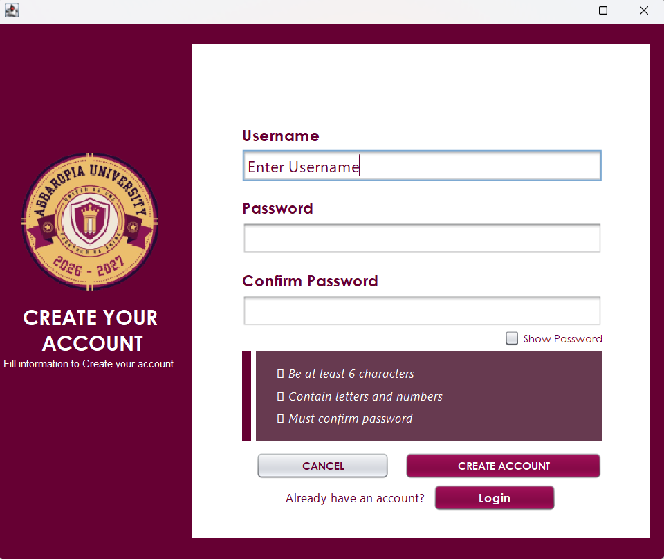
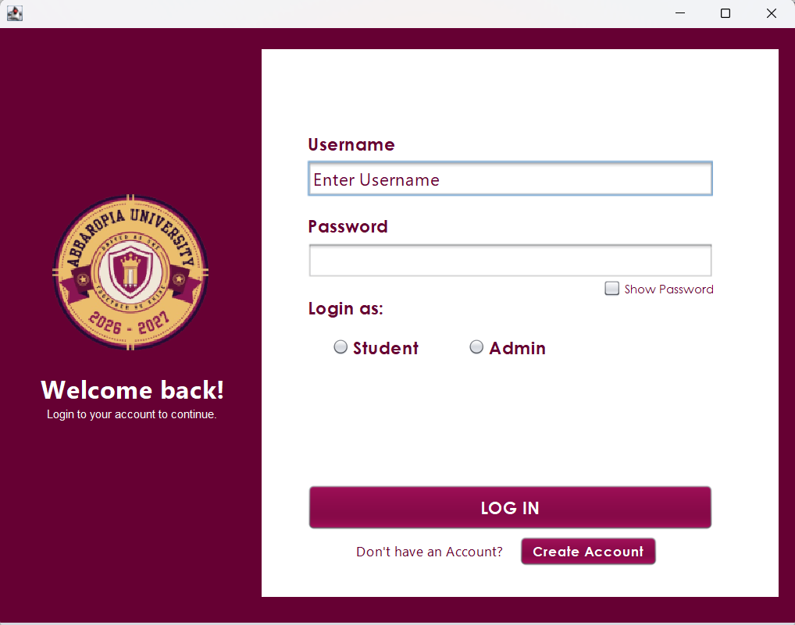
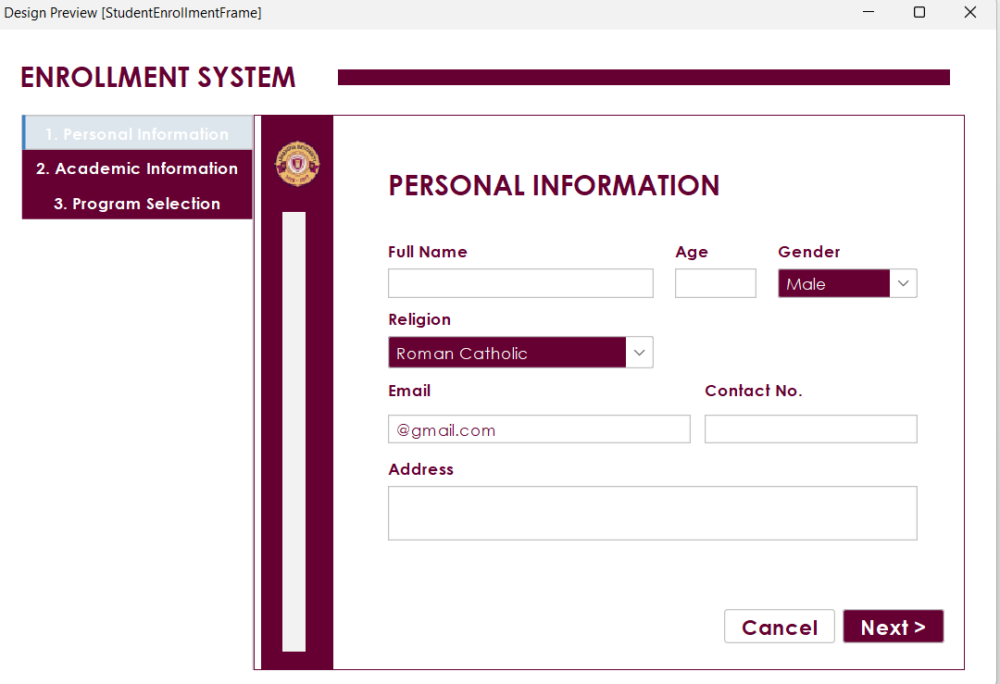
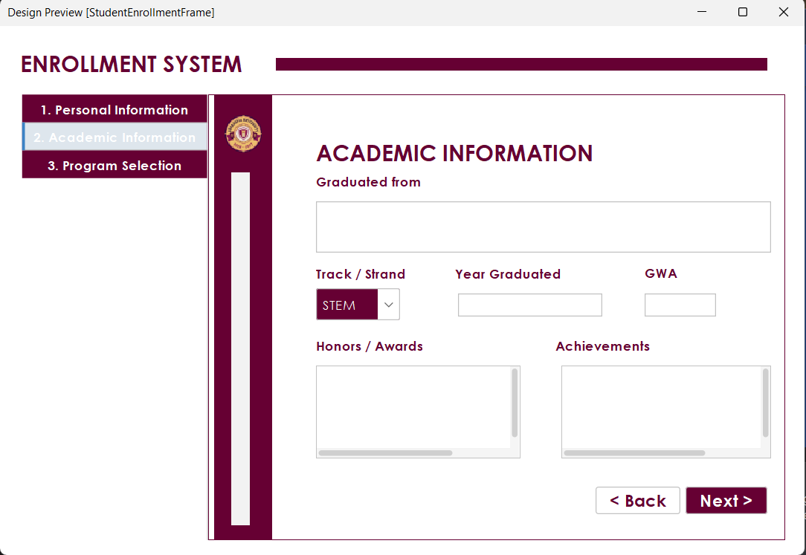
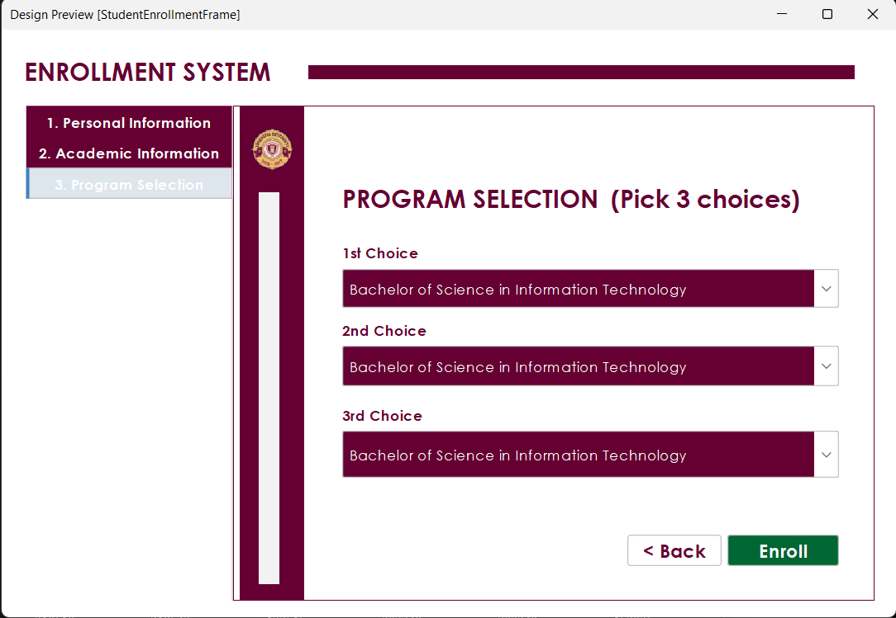
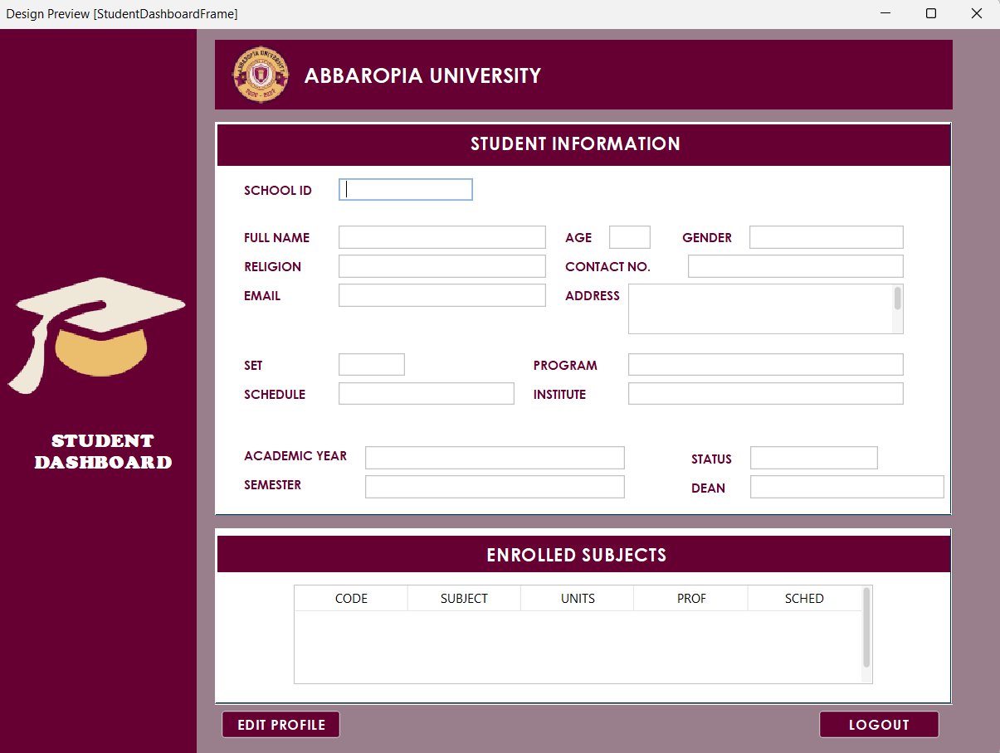
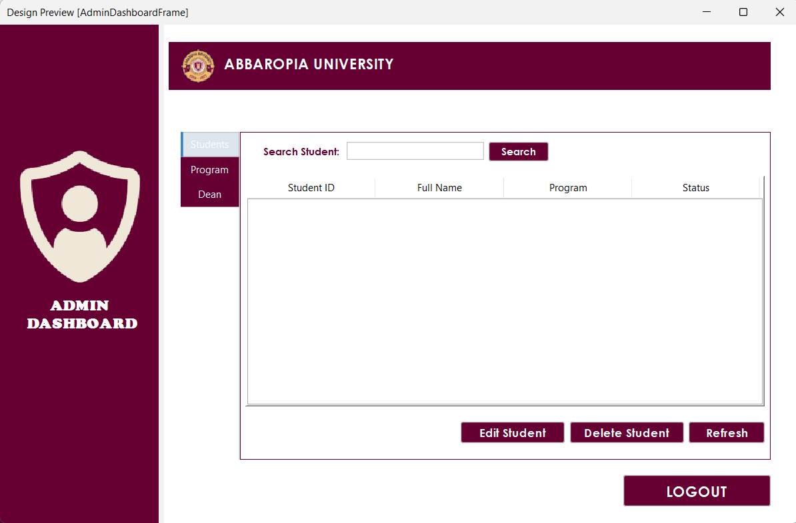
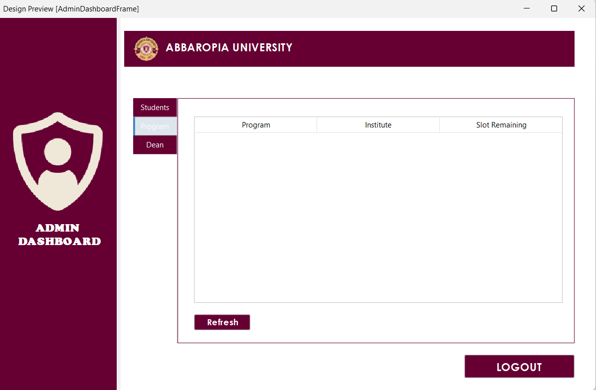
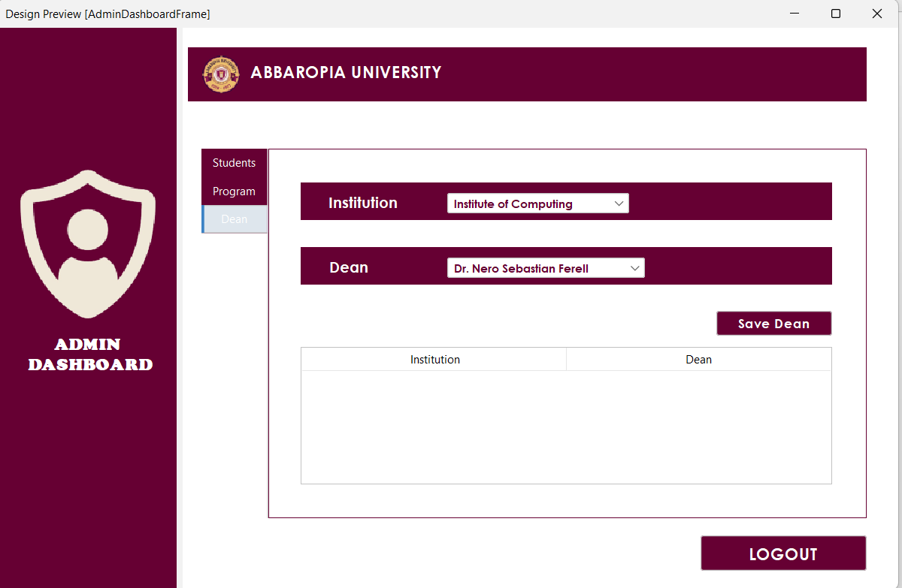

# Enrollment-Management-System

A Java Swing application for student enrollment management.

## Features

- Student Registration
- Subject Enrollment
- Course Selection
- Database Integration

## Screenshots

### Welcome Frame

### Create Account Frame

### Login Fram

## Student Enrollment Frame

## Student Dashboard Frame

## Admin Dashboard Frame

- Java
- Swing
- MySQL
